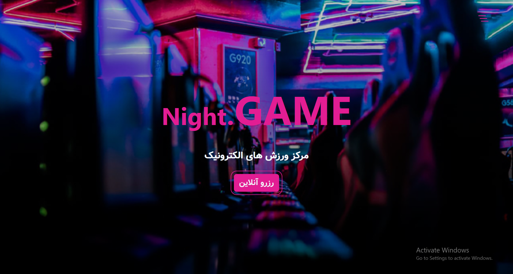
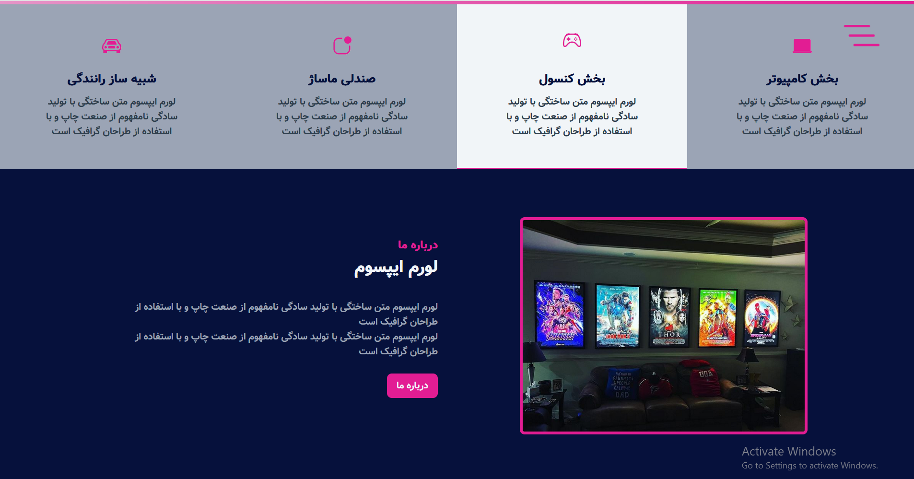
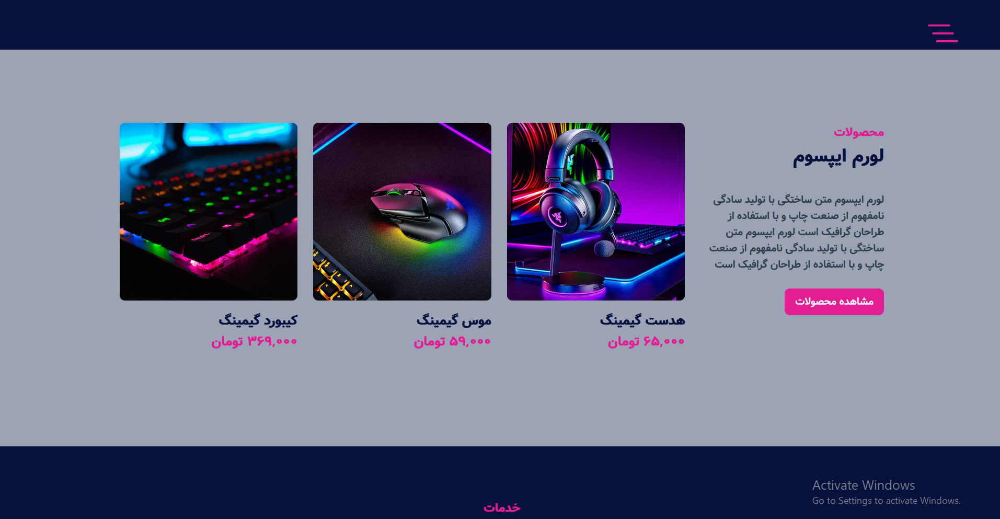
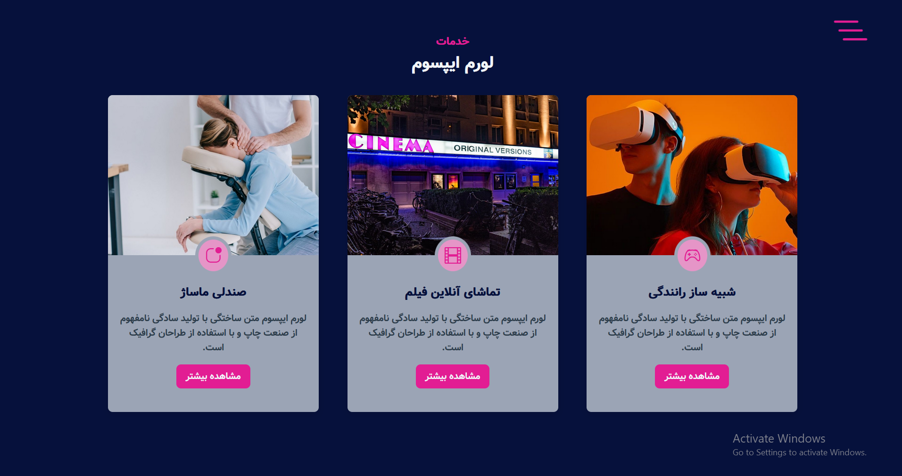
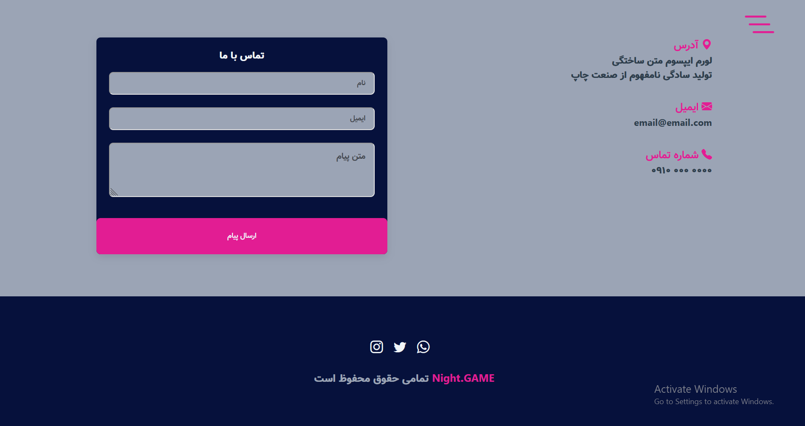

# Night.GAME

⚡Project for 2nd October - Subject -> **Game-Website**

I created this site after watching the flexbox course.  
The site is responsive, but it is not yet dynamic.  
I will do that later.  😁

## 🔗 See Live Demo [here](https://strassntial.github.io/Game-Website) .

###  Technologies used :
>
> - Html
> - Css
>- Bootstrap  

### 👀 How does the website look?
#### Home 

### About

### Products

### Services

### Contact

### ✔️ To-Do's
🌝Adding features to the site (Light mode functionality)   
🌝Add JavaScript to pages and make it dynamic
### 🌌 License  
Free to use ;)